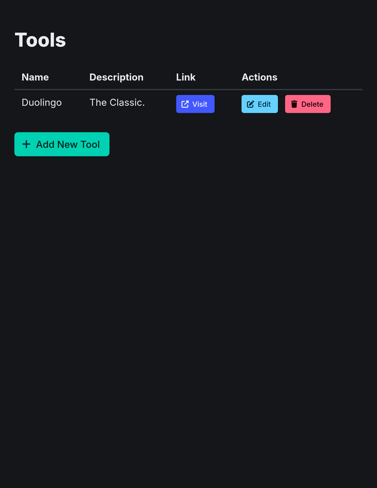

# Best Language App

> [!NOTE]  
> *Archived Prototype. I'll come back to it in the future.*

The website to find a language learning app fitting for *you*.

*Very, very work in progress.*

## Architecture

- Experiment using VIPER
  - (check Obs/notebook)

## Misc

### ISO Languages Resources

- https://www.ditig.com/iso-639-language-codes
- https://en.wikipedia.org/wiki/List_of_ISO_639_language_codes
- https://gist.github.com/Josantonius/b455e315bc7f790d14b136d61d9ae469

- almost worth its own repo, with some scrapers, some structured data, etc.
